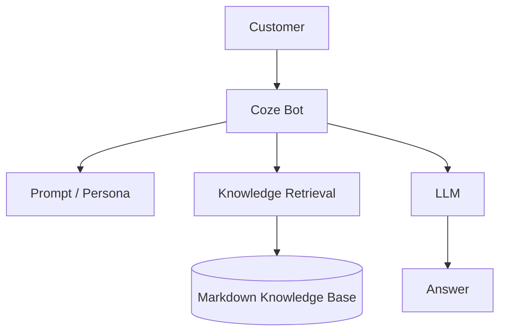

# Coze Ecommerce Support Bot

**Build a knowledge-base-powered ecommerce support bot with Coze without writing application code.**

[English](./README.md) | [简体中文](./README.zh-CN.md)

---

## 🎯 What it is

A platform-based ecommerce support bot built with Coze, a prompt, and a small knowledge base.

The repository focuses on a simple use case: repetitive customer questions such as returns, logistics and payment.

---

## 🎬 Demo

---

## ⚡ Quick Start

This project is configured in Coze rather than built locally.

1. Create or import a bot in Coze.
2. Upload the Markdown files from `knowledge/`.
3. Wait for the platform to chunk and index the documents.
4. Connect the knowledge base to the bot / workflow.
5. Test representative customer questions.
6. Publish to the channel you need.

---

## 📚 Knowledge Base

The repository includes example policy content for common ecommerce support topics:

| Document area | Typical questions |
|---|---|
| FAQ | accounts, orders, payment, coupons, membership |
| Returns | eligibility, process, refund timing |
| Logistics | delivery time, shipping fee, tracking and exceptions |

---

## 🧪 Suggested Test Set

Do not validate the bot with only one happy-path question.

Test at least:

| Test | What to check |
|---|---|
| “How do I return an item?” | correct policy and steps |
| “How long does delivery take?” | correct logistics source |
| “What payment methods are supported?” | correct FAQ retrieval |
| unsupported question | does not invent a policy |
| ambiguous wording | asks or answers appropriately |
| conflicting documents | retrieval behavior remains understandable |

---

## 🧩 Architecture

---

## 💡 What this project demonstrates

- low-code / no-code AI application building
- prompt design
- knowledge-base configuration
- basic RAG thinking
- scenario-based bot testing
- deployment through a managed agent platform

---

## ⚠️ Current Limitations

- behavior depends on Coze platform capabilities and configuration
- this repository does not contain a self-hosted backend
- live order / logistics queries require external API integrations
- production customer service still needs escalation and human handoff design

---

## 🗺 Roadmap

- [x] FAQ / return / logistics knowledge
- [x] customer-service prompt
- [x] Coze knowledge retrieval
- [ ] order-status API
- [ ] logistics API
- [ ] conversation memory
- [ ] human escalation
- [ ] evaluation dataset
- [ ] more support channels

---

## 📄 License

[MIT](./LICENSE)

**Start with the repeated questions. Add automation only where the knowledge is reliable.**

