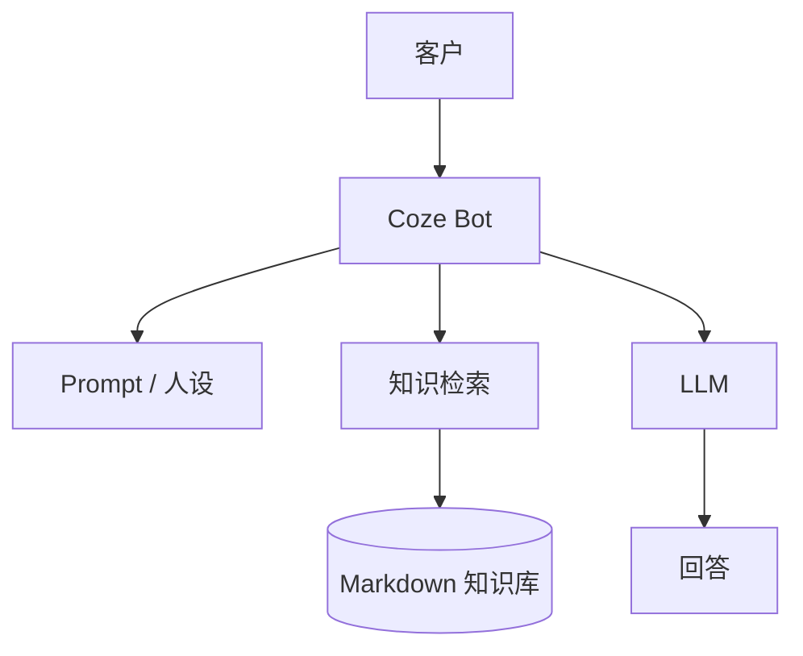

# Coze 电商智能客服

**用 Coze 零代码搭建一个由知识库驱动的电商 AI 客服。**

[English](./README.md) | [简体中文](./README.zh-CN.md)

---

## 🎯 它是什么

一个基于 Coze 平台、Prompt 和小型知识库搭建的电商客服 Bot。

重点解决的是退换货、物流、支付等每天重复出现的客服问题。

---

## 🎬 演示

---

## ⚡ 快速开始

这是平台配置型项目，不需要本地编译。

1. 在 Coze 创建或导入 Bot。
2. 上传 `knowledge/` 下的 Markdown 文档。
3. 等待平台完成切片和索引。
4. 在 Bot / Workflow 中关联知识库。
5. 用代表性的客服问题验证回答。
6. 发布到需要的渠道。

---

## 📚 知识库

仓库包含常见电商客服政策示例：

| 文档方向 | 常见问题 |
|---|---|
| FAQ | 账户、订单、支付、优惠券、会员 |
| 退换货 | 条件、流程、退款时效 |
| 物流 | 配送时效、运费、查询、异常处理 |

---

## 🧪 建议测试集

不要只用一条正常问题证明“Bot 能回答”。

至少测试：

| 测试 | 关注点 |
|---|---|
| “怎么退货？” | 是否命中正确政策和步骤 |
| “多久发货？” | 是否来自物流知识 |
| “支持哪些支付方式？” | 是否命中 FAQ |
| 知识库外问题 | 是否会编造不存在的规则 |
| 模糊表达 | 是否能合理澄清或回答 |
| 文档冲突 | 检索行为是否可解释 |

---

## 🧩 技术架构

---

## 💡 这个项目能证明什么

- 低代码 / 零代码 AI 应用搭建
- Prompt 设计
- 知识库配置
- 基础 RAG 思维
- 场景化 Bot 测试
- 托管 Agent 平台发布流程

---

## ⚠️ 当前限制

- 行为依赖 Coze 平台能力和配置
- 仓库本身没有自托管后端
- 实时订单 / 物流查询需要外部 API
- 真正生产客服仍然需要转人工和异常升级机制

---

## 🗺 路线图

- [x] FAQ / 退换货 / 物流知识
- [x] 客服 Prompt
- [x] Coze 知识检索
- [ ] 订单状态 API
- [ ] 物流 API
- [ ] 对话记忆
- [ ] 转人工
- [ ] 评测数据集
- [ ] 更多渠道

---

## 📄 License

[MIT](./LICENSE)

**先解决重复问题，再把自动化建立在可靠知识之上。**

